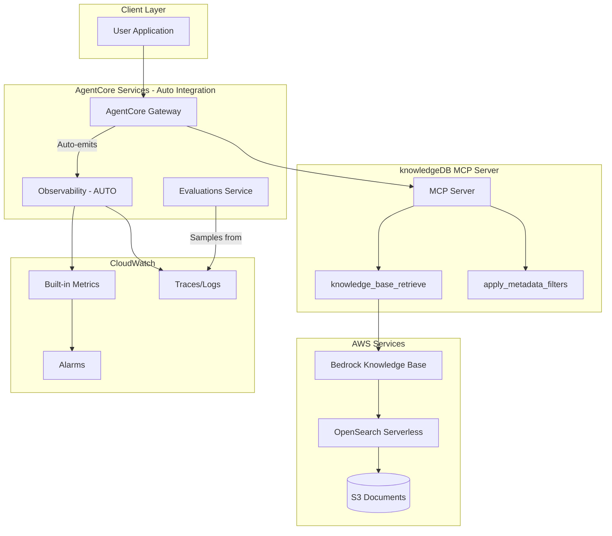

# AgentCore Evaluations Design Doc for Knowledge Base MCP Agent

## Overview and Goals

- **Purpose**: Continuous quality monitoring of the KB MCP agent in production
- **Key objectives**: Ensure retrieval accuracy, response faithfulness, and user helpfulness
- **Target System**: [knowledgeDB](https://github.com/JKevinXu/knowledgeDB) - Amazon Bedrock Knowledge Base with metadata filtering

---

## Gateway Auto-Integration (Recommended)

When MCP servers are integrated through AgentCore Gateway, **observability is automatic** - no custom instrumentation required.

### What Gateway Provides Automatically

| Feature | Status | Manual Work |
|---------|--------|-------------|
| Usage metrics | Built-in | None |
| Invocation metrics | Built-in | None |
| Performance metrics | Built-in | None |
| Error rates | Built-in | None |
| CloudWatch integration | Built-in | None |
| OpenTelemetry format | Built-in | None |
| Custom spans/metrics | Optional | ADOT SDK |

**Reference**: [AgentCore Observability Configuration](https://docs.aws.amazon.com/bedrock-agentcore/latest/devguide/observability-configure.html)

---

## Architecture



### MCP Server Requirements (for Gateway)

- OAuth authentication (client ID, client secret, discovery URL)
- Tool capabilities support
- Supported MCP protocol versions: **2025-06-18** and **2025-03-26**

**Reference**: [AgentCore Gateway Documentation](https://docs.aws.amazon.com/marketplace/latest/userguide/bedrock-agentcore-gateway.html)

---

## Log Schema (Auto-captured by Gateway)

AgentCore Observability automatically captures structured logs:

```json
{
  "timestamp": "2025-01-03T10:30:00Z",
  "resource_arn": "arn:aws:bedrock-agentcore:...",
  "event_timestamp": "2025-01-03T10:30:00.123Z",
  "account_id": "123456789012",
  "request_id": "req-uuid",
  "session_id": "session-uuid",
  "trace_id": "trace-uuid",
  "span_id": "span-uuid",
  "service_name": "knowledgedb-mcp",
  "operation": "knowledge_base_retrieve",
  "request_payload": {
    "query": "What is the refund policy?",
    "filters": {
      "department": "finance",
      "accessLevel": "internal"
    }
  },
  "response_payload": {
    "response": "The refund policy states...",
    "retrieved_documents": [...]
  }
}
```

**Reference**: [AgentCore Observability Data](https://docs.aws.amazon.com/bedrock-agentcore/latest/devguide/observability-tool-metrics.html)

---

## Built-in Evaluators

| Evaluator | Purpose | Priority |
|-----------|---------|----------|
| **Faithfulness** | Response grounded in retrieved KB context | Critical |
| **Correctness** | Factual accuracy of answers | Critical |
| **Helpfulness** | User-perceived value | High |
| **Tool Selection Accuracy** | Correct KB tool chosen | High |
| **Tool Parameter Accuracy** | Correct params extracted | Medium |
| **Harmfulness** | Detects harmful content | Medium |

---

## Custom Evaluators for knowledgeDB

Design custom evaluators specific to the knowledgeDB access control features:

| Evaluator | Purpose | Prompt Template |
|-----------|---------|-----------------|
| **Access Compliance** | Verify response respects accessLevel restrictions | "Did the response only include documents matching the user's accessLevel and allowedRoles metadata?" |
| **Metadata Filter Accuracy** | Validate correct filters applied | "Were the correct department and accessLevel filters applied based on user context?" |
| **Retrieval Relevance** | Check retrieved docs match query | "Rate 1-5 how relevant the retrieved documents are to the query." |
| **Citation Accuracy** | Verify sources are attributed | "Are document sources correctly cited in the response?" |

### Custom Evaluator Configuration

In the AgentCore Console:

- **Model**: Claude 3.5 Sonnet or similar
- **Inference Parameters**: Temperature 0.0, max tokens 256
- **Judging Prompt**: See templates above
- **Scale**: 1-5 numeric or Pass/Fail labels
- **Scope**: Per tool call (for filter accuracy) or per trace (for response quality)

---

## Configuration Strategy

| Environment | Sampling Rate | Purpose |
|-------------|---------------|---------|
| Production | 10-20% | Cost-effective monitoring |
| Staging | 100% | Full coverage before deploy |
| Testing | 100% | Regression detection |

---

## Alerting Thresholds

| Metric | Warning | Critical |
|--------|---------|----------|
| Faithfulness | < 0.85 (8hr avg) | < 0.75 (1hr avg) |
| Correctness | < 0.80 (8hr avg) | < 0.70 (1hr avg) |
| Helpfulness | < 0.75 (24hr avg) | < 0.60 (4hr avg) |
| Access Compliance | < 0.95 (1hr avg) | < 0.90 (15min avg) |

### CloudWatch Alarm Example

```bash
aws cloudwatch put-metric-alarm \
  --alarm-name "KB-Faithfulness-Low" \
  --metric-name "FaithfulnessScore" \
  --namespace "AgentCore/Evaluations" \
  --threshold 0.75 \
  --comparison-operator LessThanThreshold \
  --evaluation-periods 2 \
  --period 3600 \
  --statistic Average
```

---

## Implementation Steps

### Step 1: Enable Observability on Gateway

```bash
aws bedrock-agentcore update-gateway \
  --gateway-id <your-gateway-id> \
  --observability-config '{"enabled": true}'
```

### Step 2: Create Online Evaluation

1. Navigate to **AgentCore Console** > **Evaluations**
2. Click **Create online evaluation**
3. **Data source**: Select your AgentCore Gateway endpoint
4. **Evaluators**: Enable Faithfulness, Correctness, Helpfulness, Tool Selection
5. **Sampling rate**: 20% for production
6. Click **Create**

### Step 3: Add Custom Evaluators

1. In Evaluations, click **Create custom evaluator**
2. Configure Access Compliance evaluator:
   - Model: Claude 3.5 Sonnet
   - Prompt: "Did the response only include documents matching the user's accessLevel?"
   - Scale: Pass/Fail
   - Scope: Per trace
3. Repeat for Metadata Filter Accuracy

### Step 4: Set Up Dashboards and Alarms

1. Navigate to **CloudWatch** > **Dashboards**
2. Create dashboard with AgentCore/Evaluations metrics
3. Add alarms for threshold breaches
4. Configure SNS notifications

---

## Optional: Enhanced Instrumentation with ADOT SDK

If you need custom metrics beyond Gateway defaults:

```python
from aws_opentelemetry_distro import start_tracing
from opentelemetry import trace

# Initialize ADOT
start_tracing(service_name="knowledgedb-mcp")
tracer = trace.get_tracer("knowledgedb")

@tracer.start_as_current_span("apply_access_filter")
def apply_access_filter(user_role: str, department: str):
    span = trace.get_current_span()
    span.set_attribute("user.role", user_role)
    span.set_attribute("user.department", department)
    # Your existing code
    pass
```

---

## Implementation Notes

### Existing CloudWatch Log Groups (Discovered)

The following AgentCore log groups are available in the target AWS account:

| Log Group | Purpose | Size |
|-----------|---------|------|
| `aws/spans` | OpenTelemetry traces with gen_ai attributes | ~464KB |
| `/aws/bedrock-agentcore/runtimes/mcp_server_ac-BfnedS21lC-DEFAULT` | MCP server runtime logs | ~47MB |
| `/aws/bedrock-agentcore/runtimes/mcp_server-7f96SDCezH-DEFAULT` | MCP server logs | ~18MB |
| `/aws/bedrock-agentcore/runtimes/langgraph_agent-1NyH76Cfc7-DEFAULT` | LangGraph agent logs | ~1.4MB |

### Actual Trace Schema (from `aws/spans`)

The traces use **OpenTelemetry format** with AgentCore-specific semantic conventions:

```json
{
  "resource": {
    "attributes": {
      "service.name": "langgraph_agent.DEFAULT",
      "cloud.platform": "aws_bedrock_agentcore",
      "cloud.resource_id": "arn:aws:bedrock-agentcore:us-west-2:313117444016:runtime/...",
      "aws.service.type": "gen_ai_agent",
      "telemetry.sdk.name": "opentelemetry",
      "telemetry.sdk.version": "1.33.1"
    }
  },
  "traceId": "693450f70706ee542404439f03c99a12",
  "spanId": "e6b23d1a2e6ddadc",
  "parentSpanId": "ddd354c4fb6e4656",
  "name": "chat us.anthropic.claude-3-7-sonnet-20250219-v1:0",
  "kind": "CLIENT",
  "startTimeUnixNano": 1765036280876512050,
  "endTimeUnixNano": 1765036282425105992,
  "durationNano": 1548593942,
  "attributes": {
    "aws.remote.operation": "InvokeModel",
    "gen_ai.request.model": "us.anthropic.claude-3-7-sonnet-20250219-v1:0",
    "gen_ai.request.max_tokens": 1024,
    "gen_ai.request.temperature": 0.7,
    "gen_ai.usage.input_tokens": 1086,
    "gen_ai.usage.output_tokens": 65,
    "gen_ai.response.finish_reasons": ["tool_use"],
    "gen_ai.memory.id": "langgraph_agent_mem-o5nDQxAbkB",
    "session.id": "test-token-stream-12345678901234567890",
    "http.status_code": 200
  },
  "status": { "code": "UNSET" }
}
```

### Key Fields for Evaluation

| Field | Location | Use in Evaluation |
|-------|----------|-------------------|
| `traceId` | Root | Correlate spans within a request |
| `session.id` | `attributes` | Session-level evaluation scope |
| `gen_ai.request.model` | `attributes` | Model performance comparison |
| `gen_ai.usage.*` | `attributes` | Cost and efficiency metrics |
| `gen_ai.response.finish_reasons` | `attributes` | Completion status analysis |
| `durationNano` | Root | Latency monitoring |
| `name` | Root | Operation identification |

### Query Examples

**Get recent traces:**
```bash
aws logs filter-log-events \
  --log-group-name "aws/spans" \
  --limit 10 \
  --output json
```

**Filter by gen_ai operations:**
```bash
aws logs filter-log-events \
  --log-group-name "aws/spans" \
  --filter-pattern "gen_ai" \
  --limit 10
```

---

## References

- [AWS Blog: AgentCore Evaluations Announcement](https://aws.amazon.com/blogs/aws/amazon-bedrock-agentcore-adds-quality-evaluations-and-policy-controls-for-deploying-trusted-ai-agents/)
- [AgentCore Gateway Blog](https://aws.amazon.com/blogs/machine-learning/introducing-amazon-bedrock-agentcore-gateway-transforming-enterprise-ai-agent-tool-development/)
- [AgentCore Runtime MCP Deployment](https://docs.aws.amazon.com/bedrock-agentcore/latest/devguide/runtime-mcp.html)
- [AgentCore Gateway Integration](https://docs.aws.amazon.com/marketplace/latest/userguide/bedrock-agentcore-gateway.html)
- [AgentCore Observability Configuration](https://docs.aws.amazon.com/bedrock-agentcore/latest/devguide/observability-configure.html)
- [AgentCore Observability Metrics](https://docs.aws.amazon.com/bedrock-agentcore/latest/devguide/observability-tool-metrics.html)
- [knowledgeDB Repository](https://github.com/JKevinXu/knowledgeDB)
