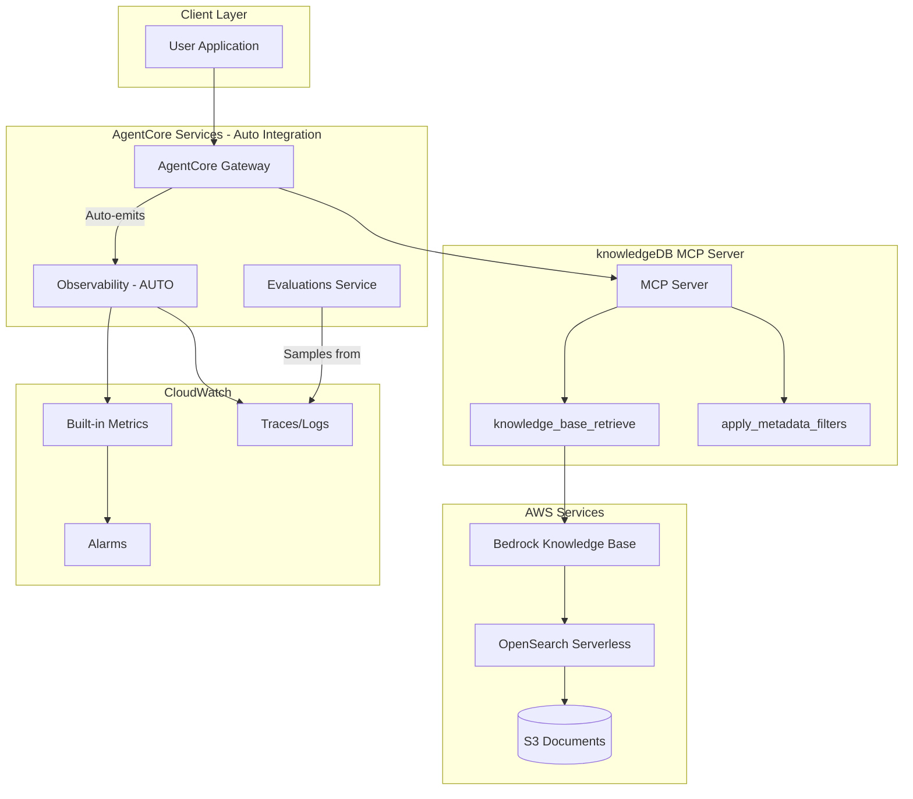

# AgentCore Evaluations Design Doc for Knowledge Base MCP Agent

## Overview and Goals

- **Purpose**: Continuous quality monitoring of the KB MCP agent in production
- **Key objectives**: Ensure retrieval accuracy, response faithfulness, and user helpfulness
- **Target System**: [knowledgeDB](https://github.com/JKevinXu/knowledgeDB) - Amazon Bedrock Knowledge Base with metadata filtering

---

## Gateway Auto-Integration (Recommended)

When MCP servers are integrated through AgentCore Gateway, **observability is automatic** - no custom instrumentation required.

### What Gateway Provides Automatically

| Feature | Status | Manual Work |
|---------|--------|-------------|
| Usage metrics | Built-in | None |
| Invocation metrics | Built-in | None |
| Performance metrics | Built-in | None |
| Error rates | Built-in | None |
| CloudWatch integration | Built-in | None |
| OpenTelemetry format | Built-in | None |
| Custom spans/metrics | Optional | ADOT SDK |

**Reference**: [AgentCore Observability Configuration](https://docs.aws.amazon.com/bedrock-agentcore/latest/devguide/observability-configure.html)

---

## Architecture



### MCP Server Requirements (for Gateway)

- OAuth authentication (client ID, client secret, discovery URL)
- Tool capabilities support
- Supported MCP protocol versions: **2025-06-18** and **2025-03-26**

**Reference**: [AgentCore Gateway Documentation](https://docs.aws.amazon.com/marketplace/latest/userguide/bedrock-agentcore-gateway.html)

---

## Log Schema (Auto-captured by Gateway)

AgentCore Observability automatically captures structured logs in OpenTelemetry format.

> **Note**: The schema below represents the **expected format** for knowledgeDB evaluation. Current auto-instrumentation captures operational metadata (tokens, latency, tool names) but may not include content fields (`request_payload`, `response_payload`) without custom instrumentation. See [Trace Data Requirements](#trace-data-requirements-for-evaluation) for details.

**Expected Schema for knowledgeDB:**

```json
{
  "timestamp": "2025-01-03T10:30:00Z",
  "resource_arn": "arn:aws:bedrock-agentcore:...",
  "event_timestamp": "2025-01-03T10:30:00.123Z",
  "account_id": "123456789012",
  "request_id": "req-uuid",
  "session_id": "session-uuid",
  "trace_id": "trace-uuid",
  "span_id": "span-uuid",
  "service_name": "knowledgedb-mcp",
  "operation": "knowledge_base_retrieve",
  "request_payload": {
    "query": "What is the refund policy?",
    "filters": {
      "department": "finance",
      "accessLevel": "internal"
    }
  },
  "response_payload": {
    "response": "The refund policy states...",
    "retrieved_documents": [...]
  }
}
```

**Reference**: [AgentCore Observability Data](https://docs.aws.amazon.com/bedrock-agentcore/latest/devguide/observability-tool-metrics.html)

---

## Built-in Evaluators

| Evaluator | Purpose | Priority |
|-----------|---------|----------|
| **Faithfulness** | Response grounded in retrieved KB context | Critical |
| **Correctness** | Factual accuracy of answers | Critical |
| **Helpfulness** | User-perceived value | High |
| **Tool Selection Accuracy** | Correct KB tool chosen | High |
| **Tool Parameter Accuracy** | Correct params extracted | Medium |
| **Harmfulness** | Detects harmful content | Medium |

---

## Custom Evaluators for knowledgeDB

Design custom evaluators specific to the knowledgeDB access control features:

| Evaluator | Purpose | Prompt Template |
|-----------|---------|-----------------|
| **Access Compliance** | Verify response respects accessLevel restrictions | "Did the response only include documents matching the user's accessLevel and allowedRoles metadata?" |
| **Metadata Filter Accuracy** | Validate correct filters applied | "Were the correct department and accessLevel filters applied based on user context?" |
| **Retrieval Relevance** | Check retrieved docs match query | "Rate 1-5 how relevant the retrieved documents are to the query." |
| **Citation Accuracy** | Verify sources are attributed | "Are document sources correctly cited in the response?" |

### Custom Evaluator Configuration

In the AgentCore Console:

- **Model**: Claude 3.5 Sonnet or similar
- **Inference Parameters**: Temperature 0.0, max tokens 256
- **Judging Prompt**: See templates above
- **Scale**: 1-5 numeric or Pass/Fail labels
- **Scope**: Per tool call (for filter accuracy) or per trace (for response quality)

---

## Configuration Strategy

| Environment | Sampling Rate | Purpose |
|-------------|---------------|---------|
| Production | 10-20% | Cost-effective monitoring |
| Staging | 100% | Full coverage before deploy |
| Testing | 100% | Regression detection |

---

## Alerting Thresholds

| Metric | Warning | Critical |
|--------|---------|----------|
| Faithfulness | < 0.85 (8hr avg) | < 0.75 (1hr avg) |
| Correctness | < 0.80 (8hr avg) | < 0.70 (1hr avg) |
| Helpfulness | < 0.75 (24hr avg) | < 0.60 (4hr avg) |
| Access Compliance | < 0.95 (1hr avg) | < 0.90 (15min avg) |

### CloudWatch Alarm Example

```bash
aws cloudwatch put-metric-alarm \
  --alarm-name "KB-Faithfulness-Low" \
  --metric-name "FaithfulnessScore" \
  --namespace "AgentCore/Evaluations" \
  --threshold 0.75 \
  --comparison-operator LessThanThreshold \
  --evaluation-periods 2 \
  --period 3600 \
  --statistic Average
```

---

## Implementation Steps

### Step 1: Enable Observability on Gateway

```bash
aws bedrock-agentcore update-gateway \
  --gateway-id <your-gateway-id> \
  --observability-config '{"enabled": true}'
```

### Step 2: Create Online Evaluation

1. Navigate to **AgentCore Console** > **Evaluations**
2. Click **Create online evaluation**
3. **Data source**: Select your AgentCore Gateway endpoint
4. **Evaluators**: Enable Faithfulness, Correctness, Helpfulness, Tool Selection
5. **Sampling rate**: 20% for production
6. Click **Create**

### Step 3: Add Custom Evaluators

1. In Evaluations, click **Create custom evaluator**
2. Configure Access Compliance evaluator:
   - Model: Claude 3.5 Sonnet
   - Prompt: "Did the response only include documents matching the user's accessLevel?"
   - Scale: Pass/Fail
   - Scope: Per trace
3. Repeat for Metadata Filter Accuracy

### Step 4: Set Up Dashboards and Alarms

1. Navigate to **CloudWatch** > **Dashboards**
2. Create dashboard with AgentCore/Evaluations metrics
3. Add alarms for threshold breaches
4. Configure SNS notifications

---

## Optional: Enhanced Instrumentation with ADOT SDK

If you need custom metrics beyond Gateway defaults:

```python
from aws_opentelemetry_distro import start_tracing
from opentelemetry import trace

# Initialize ADOT
start_tracing(service_name="knowledgedb-mcp")
tracer = trace.get_tracer("knowledgedb")

@tracer.start_as_current_span("apply_access_filter")
def apply_access_filter(user_role: str, department: str):
    span = trace.get_current_span()
    span.set_attribute("user.role", user_role)
    span.set_attribute("user.department", department)
    # Your existing code
    pass
```

---

## Trace Data Requirements for Evaluation

LLM-as-judge evaluations require specific content in traces beyond operational metadata. This section documents what data must be captured for each knowledgeDB evaluator to function.

### Required Data by Evaluator

| Evaluator | Required Trace Data | Source |
|-----------|---------------------|--------|
| **Faithfulness** | LLM response text, retrieved document content | `response_payload.response`, `response_payload.retrieved_documents` |
| **Correctness** | LLM response text | `response_payload.response` |
| **Helpfulness** | User query, LLM response text | `request_payload.query`, `response_payload.response` |
| **Access Compliance** | Applied metadata filters, retrieved documents, user context | `request_payload.filters`, `response_payload.retrieved_documents` |
| **Metadata Filter Accuracy** | Requested filters, actually applied filters | `request_payload.filters` |
| **Retrieval Relevance** | User query, retrieved documents with scores | `request_payload.query`, `response_payload.retrieved_documents` |
| **Citation Accuracy** | LLM response, source document references | `response_payload.response`, `response_payload.retrieved_documents` |
| **Tool Selection Accuracy** | User query, selected tool name | `request_payload.query`, `operation` |
| **Tool Parameter Accuracy** | User query, extracted parameters | `request_payload.query`, `request_payload.filters` |

### Expected Span Types for knowledgeDB

| Span Name | Expected Attributes | Purpose |
|-----------|---------------------|---------|
| `knowledge_base_retrieve` | `request_payload.query`, `request_payload.filters`, `response_payload.retrieved_documents` | Main retrieval operation |
| `apply_metadata_filters` | `user.role`, `user.department`, `user.accessLevel`, `filters.applied` | Access control filtering |
| `generate_response` | `gen_ai.prompt.content`, `gen_ai.completion.content` | LLM response generation |

### Gap Analysis: Auto-Instrumentation vs. Required

| Data Category | Auto-Captured by Gateway | Required for Evaluation | Gap |
|---------------|-------------------------|------------------------|-----|
| Token counts | Yes | No (optional) | None |
| Latency/duration | Yes | No (optional) | None |
| Tool names | Yes | Yes | None |
| Session/trace IDs | Yes | Yes | None |
| User query text | **Unknown** | **Yes** | Verify |
| LLM response text | **Unknown** | **Yes** | Verify |
| Retrieved documents | **Unknown** | **Yes** | Verify |
| Metadata filters | **Unknown** | **Yes** | Verify |
| User access context | **No** | **Yes** | Custom instrumentation required |

### Recommendations

1. **Deploy knowledgeDB to AgentCore Runtime** and verify actual trace content in CloudWatch
2. **If content is missing**, add custom ADOT instrumentation:

```python
from opentelemetry import trace

tracer = trace.get_tracer("knowledgedb")

@tracer.start_as_current_span("knowledge_base_retrieve")
def retrieve_from_kb(query: str, filters: dict):
    span = trace.get_current_span()
    
    # Capture input for evaluation
    span.set_attribute("request.query", query)
    span.set_attribute("request.filters", json.dumps(filters))
    
    # Execute retrieval
    results = bedrock_kb.retrieve(query, filters)
    
    # Capture output for evaluation
    span.set_attribute("response.document_count", len(results))
    span.set_attribute("response.documents", json.dumps(results[:5]))  # Limit size
    
    return results
```

3. **For access control context**, instrument the filter application:

```python
@tracer.start_as_current_span("apply_access_filter")
def apply_access_filter(user_context: dict, query: str):
    span = trace.get_current_span()
    span.set_attribute("user.role", user_context.get("role"))
    span.set_attribute("user.department", user_context.get("department"))
    span.set_attribute("user.accessLevel", user_context.get("accessLevel"))
    span.set_attribute("filters.applied", json.dumps(build_filters(user_context)))
    # ... filter logic
```

---

## References

- [AWS Blog: AgentCore Evaluations Announcement](https://aws.amazon.com/blogs/aws/amazon-bedrock-agentcore-adds-quality-evaluations-and-policy-controls-for-deploying-trusted-ai-agents/)
- [AgentCore Gateway Blog](https://aws.amazon.com/blogs/machine-learning/introducing-amazon-bedrock-agentcore-gateway-transforming-enterprise-ai-agent-tool-development/)
- [AgentCore Runtime MCP Deployment](https://docs.aws.amazon.com/bedrock-agentcore/latest/devguide/runtime-mcp.html)
- [AgentCore Gateway Integration](https://docs.aws.amazon.com/marketplace/latest/userguide/bedrock-agentcore-gateway.html)
- [AgentCore Observability Configuration](https://docs.aws.amazon.com/bedrock-agentcore/latest/devguide/observability-configure.html)
- [AgentCore Observability Metrics](https://docs.aws.amazon.com/bedrock-agentcore/latest/devguide/observability-tool-metrics.html)
- [knowledgeDB Repository](https://github.com/JKevinXu/knowledgeDB)
