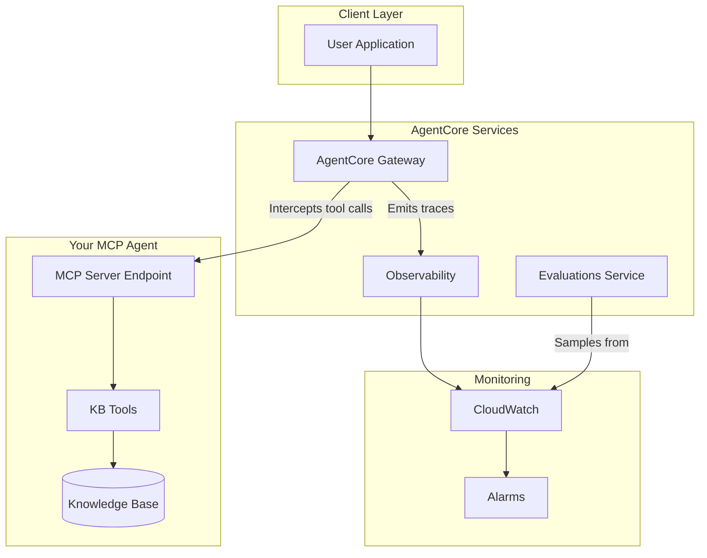

# AgentCore Evaluations Design Doc for Knowledge Base MCP Agent

## Overview and Goals

- **Purpose**: Continuous quality monitoring of the KB MCP agent in production
- **Key objectives**: Ensure retrieval accuracy, response faithfulness, and user helpfulness

---

## Architecture - MCP Endpoint Integration



### MCP Integration Options

| Option | Description | When to Use |
|--------|-------------|-------------|
| **A: AgentCore Gateway** | Route MCP through Gateway; auto-captures traces | New deployments, need Policy controls |
| **B: CloudWatch Logs** | Agent logs to CloudWatch; Evaluations samples from logs | Existing MCP deployments |

### MCP Server Requirements (for Gateway integration)

- OAuth authentication (client ID, client secret, discovery URL)
- Tool capabilities support
- Supported MCP protocol versions: **2025-06-18** and **2025-03-26**

**Reference**: [AgentCore Gateway Documentation](https://docs.aws.amazon.com/marketplace/latest/userguide/bedrock-agentcore-gateway.html)

---

## Log Schema (Official AgentCore Observability Format)

AgentCore Observability captures structured logs with these fields:

```json
{
  "timestamp": "2025-01-03T10:30:00Z",
  "resource_arn": "arn:aws:bedrock-agentcore:...",
  "event_timestamp": "2025-01-03T10:30:00.123Z",
  "account_id": "123456789012",
  "request_id": "req-uuid",
  "session_id": "session-uuid",
  "trace_id": "trace-uuid",
  "span_id": "span-uuid",
  "service_name": "kb-mcp-agent",
  "operation": "knowledge_base_search",
  "request_payload": {
    "query": "What is the refund policy?"
  },
  "response_payload": {
    "response": "The refund policy states...",
    "retrieved_documents": [...]
  }
}
```

**Reference**: [AgentCore Observability Data](https://docs.aws.amazon.com/bedrock-agentcore/latest/devguide/observability-tool-metrics.html)

---

## Built-in Evaluators Selection

| Evaluator | Purpose | Priority |
|-----------|---------|----------|
| **Faithfulness** | Response grounded in retrieved KB context | Critical |
| **Correctness** | Factual accuracy of answers | Critical |
| **Helpfulness** | User-perceived value | High |
| **Tool Selection Accuracy** | Correct KB tool chosen | High |
| **Tool Parameter Accuracy** | Correct params extracted | Medium |
| **Harmfulness** | Detects harmful content | Medium |

---

## Custom Evaluators for KB Agent

Design custom evaluators specific to knowledge base use cases:

1. **Retrieval Relevance** - Are retrieved docs relevant to query?
2. **Citation Accuracy** - Are sources correctly attributed?
3. **Knowledge Coverage** - Does response fully address query?
4. **Hallucination Detection** - Claims unsupported by context?

### Custom Evaluator Configuration

In the AgentCore Console, custom evaluators require:

- **Model**: The LLM to use as a judge (e.g., Claude, GPT-4)
- **Inference Parameters**: Temperature, max output tokens
- **Judging Prompt**: Instructions for scoring
- **Scale**: Numeric values or custom text labels
- **Scope**: Single traces, full sessions, or per tool call

---

## Configuration Strategy

| Environment | Sampling Rate | Purpose |
|-------------|---------------|---------|
| Production | 10-20% | Cost-effective monitoring |
| Staging | 100% | Full coverage before deploy |
| Testing | 100% | Regression detection |

### Filters

- By user segment
- By query type
- By topic domain

---

## Alerting Thresholds

Define CloudWatch alarms for quality degradation:

| Metric | Warning | Critical |
|--------|---------|----------|
| Faithfulness | < 0.85 (8hr avg) | < 0.75 (1hr avg) |
| Correctness | < 0.80 (8hr avg) | < 0.70 (1hr avg) |
| Helpfulness | < 0.75 (24hr avg) | < 0.60 (4hr avg) |

---

## Implementation Steps

1. **Deploy MCP agent using AgentCore Runtime**
   - Build Docker container and push to Amazon ECR
   - Configure OAuth authentication
   - Use AgentCore CLI to create runtime
   - [Guide](https://docs.aws.amazon.com/bedrock-agentcore/latest/devguide/runtime-mcp.html)

2. **Integrate with AgentCore Gateway**
   - Register MCP server tools with Gateway
   - Configure OAuth settings
   - Test integration
   - [Docs](https://docs.aws.amazon.com/marketplace/latest/userguide/bedrock-agentcore-gateway.html)

3. **Enable Observability**
   - Enable observability on agent resource
   - Configure log destinations (CloudWatch Logs, S3, or Firehose)
   - [Guide](https://docs.aws.amazon.com/bedrock-agentcore/latest/devguide/observability-get-started.html)

4. **Create online evaluation in AgentCore Console**
   - Navigate to Evaluations > Create online evaluation
   - Select data source (AgentCore endpoint or CloudWatch log group)
   - Configure sampling rate and filters

5. **Configure built-in + custom evaluators**
   - Select built-in evaluators (Faithfulness, Correctness, Helpfulness)
   - Create custom evaluators for KB-specific metrics
   - Define scoring scales and prompts

6. **Set up CloudWatch dashboards and alarms**
   - Create dashboard for evaluation metrics
   - Configure alarms with thresholds defined above
   - Set up SNS notifications for alerts

---

## References

- [AWS Blog: AgentCore Evaluations Announcement](https://aws.amazon.com/blogs/aws/amazon-bedrock-agentcore-adds-quality-evaluations-and-policy-controls-for-deploying-trusted-ai-agents/)
- [AgentCore Runtime MCP Deployment](https://docs.aws.amazon.com/bedrock-agentcore/latest/devguide/runtime-mcp.html)
- [AgentCore Gateway Integration](https://docs.aws.amazon.com/marketplace/latest/userguide/bedrock-agentcore-gateway.html)
- [AgentCore Observability Guide](https://docs.aws.amazon.com/bedrock-agentcore/latest/devguide/observability-get-started.html)
- [AgentCore Observability Metrics](https://docs.aws.amazon.com/bedrock-agentcore/latest/devguide/observability-tool-metrics.html)

